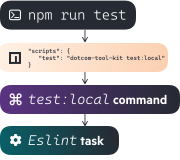

# Tool Kit's core concepts

## Plugins

Tool Kit is a fully modular set of developer tooling. Not every project requires the same tooling, so to make sure different projects only have to install and configure what they need, Tool Kit is made up of several **plugins** that you can install separately to provide different groups of functionality, like [the `npm` plugin](plugins/npm), which lets Tool Kit manage things like `package.json` scripts.

This means a project that uses Jest for its tests can install [the `jest` plugin](../plugins/jest), and a project using Mocha can install [the `mocha` plugin](plugins/mocha), and be able to run them consistently anywhere they're needed, e.g. the `npm run test` script, without having to configure that manually. Plugins can depend on other plugins, so we also publish plugins like [`frontend-app`](../plugins/frontend-app/) that bundle up most of the tooling you'll need for a particular use case  into a single package.

And if there's something you want to use in your repo that's not yet supported by Tool Kit, you can [extend it](./extending-tool-kit.md) by writing a custom plugin that works consistently with any officially-supported tooling.

Plugins provide **tasks**, which provide the code for running external tooling, and **hooks**, which manage configuration files in your repo that will be running tooling. They can also configure default **commands** that will run tasks.

## Commands

**Commands** are labels (like `test:local`) that you provide on the command line when running `dotcom-tool-kit`. They're assigned by `.toolkitrc.yml` files in your repo and in plugins to run [tasks](#tasks).

Plugins can set a default command for their tasks to run on; for example, the `Jest` task [runs by default on the `test:local` command](./plugins/jest/.toolkitrc.yml#L5). If you've got multiple tasks trying to run on the same command by default, you'll need to [configure which you want to run](./docs/resolving-plugin-conflicts.md).

## Tasks

A **task** is a lightweight abstraction for running some tooling from outside of Tool Kit. Although most tasks simply make a single call to a third-party library or CLI tool, some are more complex, orchestrating the logic for things like our deployment process for Heroku.

Tasks are written in TypeScript, so we can make use of modern Javascript-based tooling and libraries, easily provide structured logging and actionable error messages, and debug and maintain them more easily than things like Bash scripts.

An example of a task is `Jest` from the [`jest` plugin](../plugins/jest), which abstracts running Jest tests in a local development environment. Some tasks support [configuration](../readme.md#configuring-tool-kit). This doesn't replace any native configuration that tooling might have (like a `jest.config.js`).

## Hooks

A **hook** manages configuration in your repo that will be running Tool Kit commands. Things like scripts in `package.json` or jobs in your CircleCI config can be automatically managed and kept consistent by hooks.

For example, `package-json-hook` plugin provides a `PackageJson` hook that lets other plugins define npm scripts and other configuration. It's used by the `npm` plugin to configure things like the `test` script to run `dotcom-tool-kit test:local`. Any tasks that are configured to run on `test:local` will then be run when you run `npm run test`.

Hooks are there to be **installed** in your repository. Hook classes contain an `install` method that updates the relevant configuration files to run that hook. This `install` method is called when you run `npx dotcom-tool-kit --install`. This lets Tool Kit plugins automatically manage files like `package.json` or `.circleci/config.yml`. Any changes made by hook installation should be committed.

When Tool Kit starts up, it checks whether the hooks in your plugins are correctly installed, and will print an error if they're not. This prevents repos from getting out of sync with what Tool Kit expects, ensuring repos are fully consistent and correctly managed by plugins.
