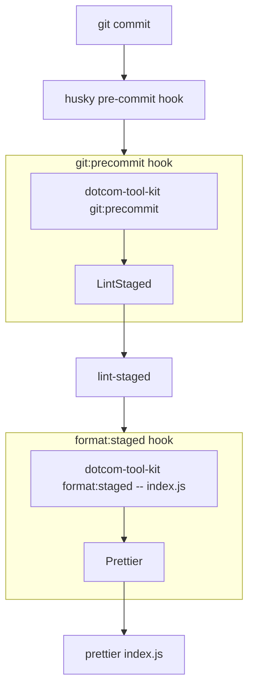

# @dotcom-tool-kit/lint-staged

A plugin to run the [lint-staged](https://github.com/okonet/lint-staged) tool to run linters on files staged via git.

## Installation

With Tool Kit [already set up](https://github.com/financial-times/dotcom-tool-kit#installing-and-using-tool-kit), install this plugin as a dev dependency:

```sh
npm install --save-dev @dotcom-tool-kit/lint-staged
```

And add it to your repo's `.toolkitrc.yml`:

```yaml
plugins:
    - '@dotcom-tool-kit/lint-staged'
```

## How LintStaged interacts with other hooks

The `LintStaged` is quite special as it's a task that will run other Tool Kit hooks. That means you can have a hook that will run this task that will in turn run other hooks that will run further tasks! The indirection can be hard to get your head around. Typically, you'll want to set up `LintStaged` to run on a Tool Kit hook hooked to a git hook via another plugin like [husky-npm](../husky-npm) (`LintStaged` by default runs on the `git:precommit` hook). Then it will call the `lint-staged` executable that will read your lint-staged configuration to see what further programs need to be run: these programs should be other Tool Kit hooks that can be configured using a plugin like [lint-staged-npm](../lint-staged-npm).

An example `package.json` config set up with lint-staged and Tool Kit could have these fields:

```json
{
  "husky": {
    "hooks": {
      "pre-commit": "dotcom-tool-kit git:precommit"
    }
  },
  "lint-staged": {
    "**/*.js": "dotcom-tool-kit format:staged test:staged --"
  }
}
```

This will run the `git:precommit` hook when making a git commit, and the `LintStaged` task in `git:precommit` will run the `lint-staged` binary, which will pass all the staged JavaScript files to a Tool Kit invocation that will call the `format:staged` and `test:staged` hooks (see the [`lint-staged-npm` README](../lint-staged-npm/readme.md) for further information on what we do with the passed files). This control flow is illustrated in the following diagram:



<!-- begin autogenerated docs -->
## Tasks

### `LintStaged`

Run `lint-staged` in your repo, for use with git hooks.
<!-- end autogenerated docs -->
