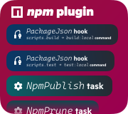
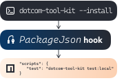

<h1 align="center">
   
</h1>

[](https://circleci.com/gh/Financial-Times/dotcom-tool-kit)

Tool Kit is modern developer tooling for FT.com repositories. It's fully modular, allowing repos that need different tooling to install separate plugins that work consistently together.

## Installing and using Tool Kit

### Interactive installation & migration

For an empty repository (containing at least a valid `package.json`), or to migrate an existing repo from [n-gage](https://github.com/financial-times/n-gage), you can run the interactive Tool Kit init script:

```sh
npm init @dotcom-tool-kit
```

See [the migration guide](./docs/migrating-to-tool-kit.md) for a full explanation of what this script does.

### Installing and configuring manually

Install the core of Tool Kit as a `devDependency`:

```sh
npm install --save-dev dotcom-tool-kit
```

On its own, Tool Kit doesn't do anything, so you'll need to install some [plugins](./plugins) to give it functionality. For example, if you want to run Jest tests with `npm run test` via Tool Kit, you can install the `jest` and `npm` plugins:

```sh
npm install --save-dev @dotcom-tool-kit/npm @dotcom-tool-kit/jest
```

Add a `.toolkitrc.yml` to the root of your repository to include these plugins:

```yml
plugins:
  - '@dotcom-tool-kit/npm'
  - '@dotcom-tool-kit/jest'
```

Every time you change your `.toolkitrc.yml`, e.g. adding or removing a plugin, you should tell Tool Kit to install configuration files in your repository:

```sh
npx dotcom-tool-kit --install
```

### Running Tool Kit

You don't run Tool Kit directly; you run plugin tasks using things like npm scripts, automatically configured in your `package.json` by Tool Kit. With the `npm` and `jest` plugins installed, Jest tests are run with the npm `test` script:

```sh
npm run test
```

At any time, you can run `--help` to see what plugins you have installed, what configuration files they're managing, and what tasks you can run with them:

```sh
npx dotcom-tool-kit --help
```

## How Tool Kit works

### Plugins



Tool Kit is a fully modular set of developer tooling. Not every project requires the same tooling, so to make sure different projects only have to install and configure what they need, Tool Kit is made up of several **plugins** that you can install separately to provide different groups of functionality, like [the `npm` plugin](plugins/npm), which lets Tool Kit manage things like `package.json` scripts.

This means a project that uses Jest for its tests can install [the `jest` plugin](plugins/jest), and a project using Mocha can install [the `mocha` plugin](plugins/mocha), and be able to run them consistently anywhere they're needed, e.g. the `npm run test` script. Plugins can depend on other plugins, so we can also publish plugins like `frontend-app` that bundle up most of the tooling you'll need into a single package.

And if there's something you want to use in your repo that's not yet supported by Tool Kit, you can write a [custom plugin](docs/custom-plugins.md) so it can work consistently with any officially-supported tooling.

Plugins provide **tasks**, which provide the code for running external tooling, and **hooks**, which manage configuration files in your repo that will be running tooling.

### Tasks

A **task** is a lightweight abstraction for running some tooling from outside of Tool Kit. Tasks are written in TypeScript, so we can make use of modern Javascript-based tooling and libraries, easily provide structured logging and actionable error messages, and debug them more easily than things like Bash scripts.

An example of a task is `JestLocal` from the `jest` plugin, which abstracts running Jest tests in a local development environment. Some tasks support [configuration](#configuration). This doesn't replace any native configuration that tooling might have (like a `jest.config.js`).

### Hooks


A **hook** is the glue between configuration in your repo that will be running Tool Kit and the tasks themselves. Things like scripts in `package.json` or jobs in your CircleCI config can be automatically managed and kept consistent by hooks.

For example, the `test:local` hook in the `npm` plugin ensures the `test` script is defined in `package.json` to run `dotcom-tool-kit test:local`, then any tasks that are configured to run on `test:local` will be run when you run `npm run test`.

Plugins can set a default hook for their tasks to run on; for example, the `JestLocal` task runs by default on the `test:local` hook. If you've got multiple tasks trying to run on the same hook by default, you'll need to [configure which you want to run](./docs/resolving-hook-conflicts.md).



Hooks are there to be **installed** in your repository. Hook classes contain an `install` method that updates the relevant configuration files to run that hook. This `install` method is called when you run `npx dotcom-tool-kit --install`. This lets Tool Kit plugins automatically manage files like `package.json` or `.circleci/config.yml`. Any changes made by hook installation should be committed.

When Tool Kit starts up, it checks whether the hooks in your plugins are correctly installed, and will print an error if they're not. This prevents repos from getting out of sync with what Tool Kit expects, ensuring repos are fully consistent and controlled by Tool Kit plugins.

### Configuration

The `.toolkitrc.yml` file in your repo determines everything about how Tool Kit runs in that repo. It controls what plugins are included (which determine what hooks and tasks are available), gives you fine-grained control over what tasks are running on what hooks, and lets you provide options to plugins.

An example `.toolkitrc.yml` might look like:

```yml
plugins:
  # provides the test:local hooks
  - '@dotcom-tool-kit/npm'
  # provides the JestLocal task
  - '@dotcom-tool-kit/jest'
  # provides the Eslint task
  - '@dotcom-tool-kit/eslint'

hooks:
  # run both Jest and ESlint when running `npm run test`
  # required to resolve the conflict between their defaults
  test:local:
    - Eslint
    - JestLocal

options:
  # ESlint plugin needs to know which files to run ESlint on.
  # there's a default setting, but your repo might need something else
  '@dotcom-tool-kit/eslint':
    files:
      - server/**/*.js
```

The options available for each plugin are documented in their readmes. If the tooling that a plugin is using has its own method of configuration (like `.eslintrc`, `.babelrc`, `jest.config.js`, `webpack.config.js`), Tool Kit options aren't used for that; they're not merged with that config and don't replace it. Tool Kit options are only for things that need to be known to run the tooling in the first place, or where tooling doesn't provide its own configuration.

## Contributing

Tool Kit is organised as a monorepo with all the different plugins and libraries stored in a single repository. This allows us to quickly investigate and make changes across the whole codebase, as well as making installation easier by sharing dependencies. See the [developer documentation](./docs/developing-tool-kit.md) for a full explanation of the internal architecture of Tool Kit.

Release versions are not kept in sync between the packages, as we do not want to have to a major version bump for every package whenever we release a breaking change for a single package.

We use [release-please](https://github.com/googleapis/release-please) to manage releases and versioning. Every time we make a merge to main, release-please checks which packages have been changed, and creates a PR to make new releases for them. It uses the [Conventional Commits](https://www.conventionalcommits.org/en/v1.0.0/) standard to determine whether updates require a patch, minor, or major version bump, and we use [commitlint](https://commitlint.js.org) to enforce the standard in all of our commits.

This means you should make an effort to think carefully about whether the changes you're making are a new feature or bug fix, and whether they contain any breaking changes. This might seem burdensome at first but it's good practice to make sure you can predict whether other teams' builds are going to break because of your code changes! If your commit will only affect a single package then please also include the name of the package (without the `@dotcom-tool-kit` namespace) in the scope of your commit message, as this makes it easier to see where changes are being made just by a quick glance at the git log. For example, a commit message for a new feature for the `circleci` plugin might look like:
```
feat(circleci): add support for nightly workflows
```

Note that new plugins should be created with a version number of `0.1.0`. This indicates that the package is still in the early stages of development and could be subject to many breaking changes before it's stabilised. Committing breaking changes whilst your package is `<1.0.0` are treated as minor bumps (`0.2.0`) and both new features and bug fixes as patch bumps (`0.1.1`.) When you're ready, you can release a 1.0 of your plugin by including `Release-As: 1.0.0` in the body of the release commit.
